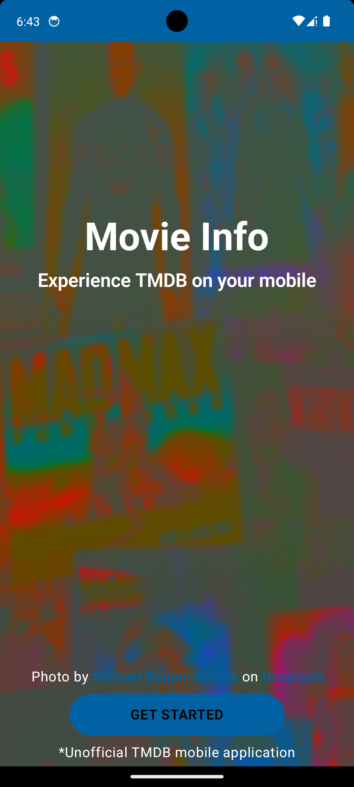
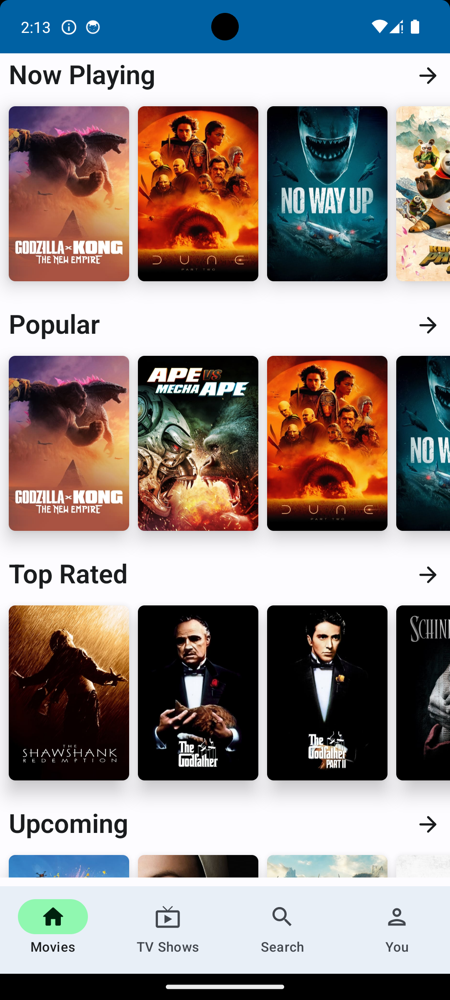
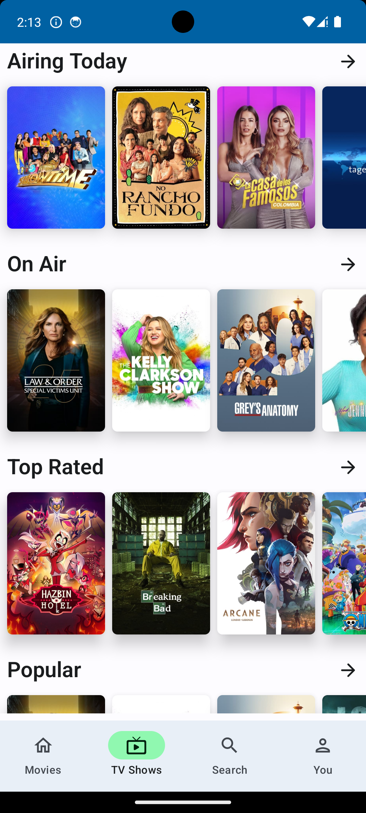
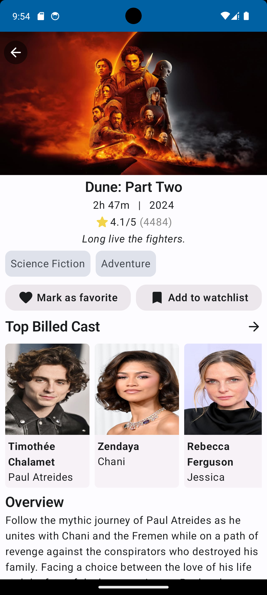
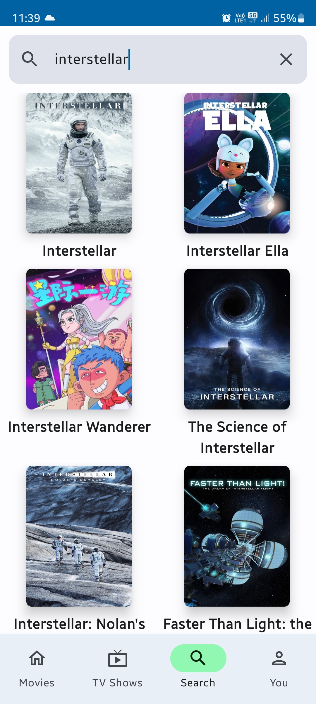
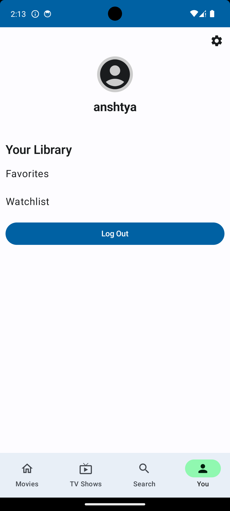
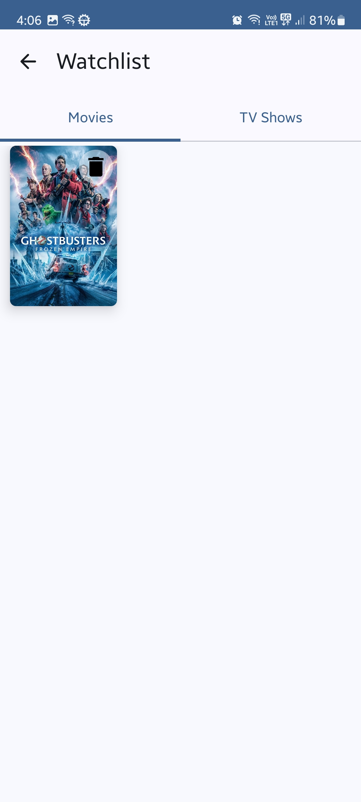

# MovieInfo
Provides movies, tv shows and person information from [TMDB API](https://api.tmdb.org/).

**Note:** Migrated to [MovieInfo-kmp](github.com/anshtya/movieinfo-kmp).

## 📸 Screenshots
|   |   |   |   |
|---|---|---|---|
|  |  |  |  |
|  |  |  |


## ✨ Features
- Discover popular and trending movies and TV shows.
- Connect your TMDB account to access your TMDB watchlists and favorites.

## 🏗️ Architecture
- Built with a multi-module architecture, utilizing a hybrid approach that combines feature and layer-based modularization.
- Inspired by [common modularization patterns](https://developer.android.com/topic/modularization/patterns).

## 🖥️Installation
To clone the project, run

```
git clone git@github.com:anshtya/MovieInfo.git
```
Open the project in Android Studio.

Visit [TMDB API](https://api.tmdb.org/) to obtain Access Token. Open `local.poperties` file and type the following:
```
ACCESS_TOKEN = your_access_token
```

and rebuild the project.

## ℹ️Disclaimer


This product uses the [TMDB API](https://api.tmdb.org/) but is not endorsed or certified by [TMDB](https://themoviedb.org).
